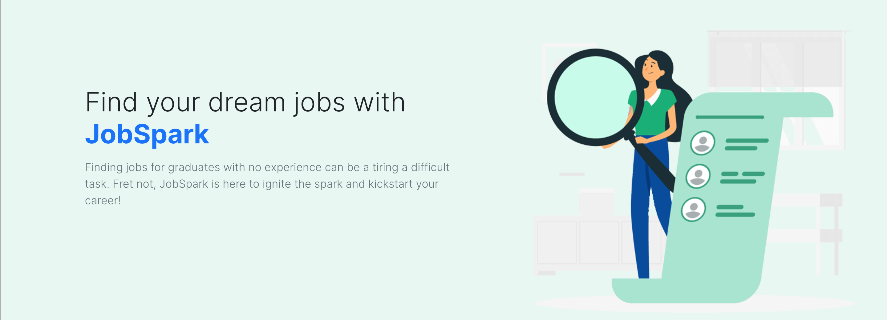
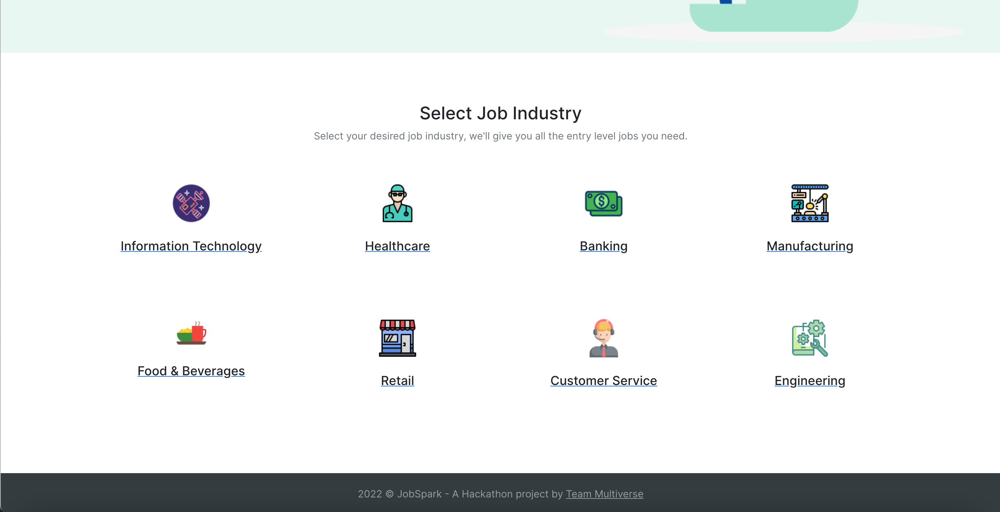
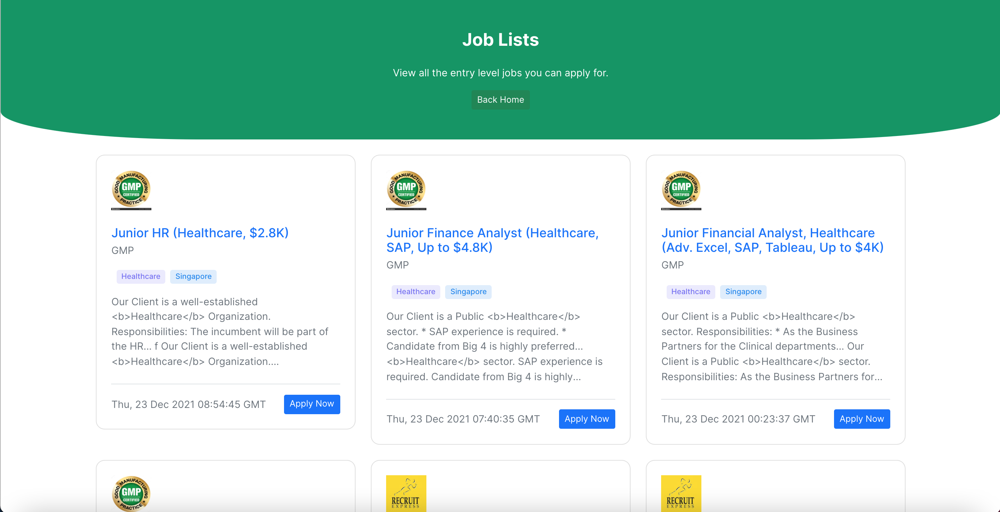
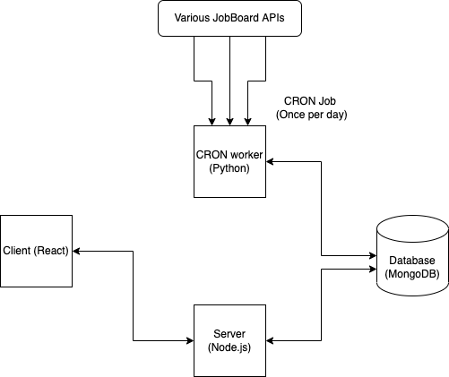

  

<h1 align="center">
  JobSpark
</h1>

  The one stop platform for fresh grads to find jobs and kickstart their career!

## 📖 Overview

Fresh grads and university students always find it difficult to find jobs since they have no experience. There are many jobs available that do not require any experience. However, these jobs are scattered across all kinds of different job portals. Since fresh grads will likely have to apply to many of these jobs to even get an interview, manually going to all these job portals to search can be troublesome.

## 🔎 What it does

Users can select the industry that they would like to find their junior postion jobs. 

Once an industry is selected, all the junior postion jobs that do not require any experience will show up in a single page. Users can now conveniently view all the jobs they are eligible for in a single place. Users can also click the apply now button which will bring them to the actual posting of the job where they can apply for the job.

## 🛠️ How it was built

The client facing frontend was built in **React** with **Bootstrap**. Everytime a user clicks on an industry to view the jobs page, the client will make a request to the backend server built with **Node.js** and **Express**. The job listings are retrieved from a **MongoDB** database. We get the actual job listings from various job portal APIs. We aggregate them for the user.

To ensure that we do not overload these APIs for jobs, we cached these job postings in our MongoDB database. This is done by a **Python** CRON worker that run a CRON schedule once a day and collect the various job postings from the different APIs. It then caches them in the database. Our backend server will run a custom filtering algorithm to filter jobs and only get jobs which do not require any experience. The jobs are also filtered according the industry requested by the user. These jobs are then returned to the client.

### Application architecture:

---

> This project was built during the iNTUition v8.0 Hackathon. View the Devpost submission [here](https://devpost.com/software/jobspark)
